# LeQuyDon ERD

> Source of truth: `backend/src/modules/*/entities/*.entity.ts`. ERD la derived view, update cung commit khi sua entity. Ref: CROSS-0007

**Tong**: 19 entities, 14 modules
**Last sync**: 2026-04-18

> Quy uoc chung: tat ca entity extend `BaseEntity` (tru `RefreshToken`, `LoginAttempt`, `AppLog`, `AdminAction`, `PageView`, `PageViewDaily`, `Setting`) co cac truong: `id` (ULID PK), `created_at`, `updated_at`, `deleted_at` (soft delete). Cac truong `created_by` / `updated_by` la ULID tham chieu logic toi `users.id` (khong khai bao FK cung trong TypeORM).

---

## Module: users

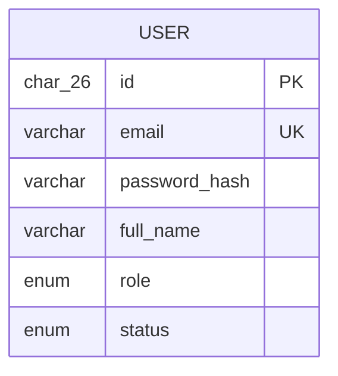

---

## Module: auth

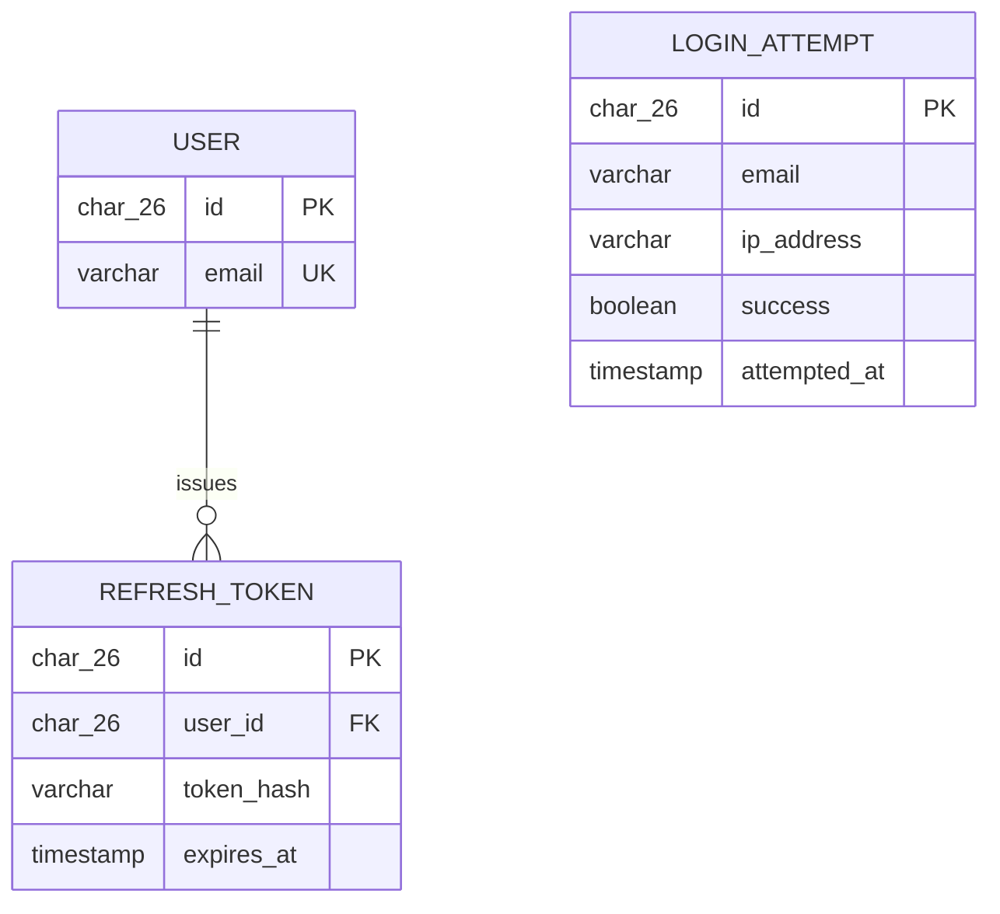

---

## Module: categories

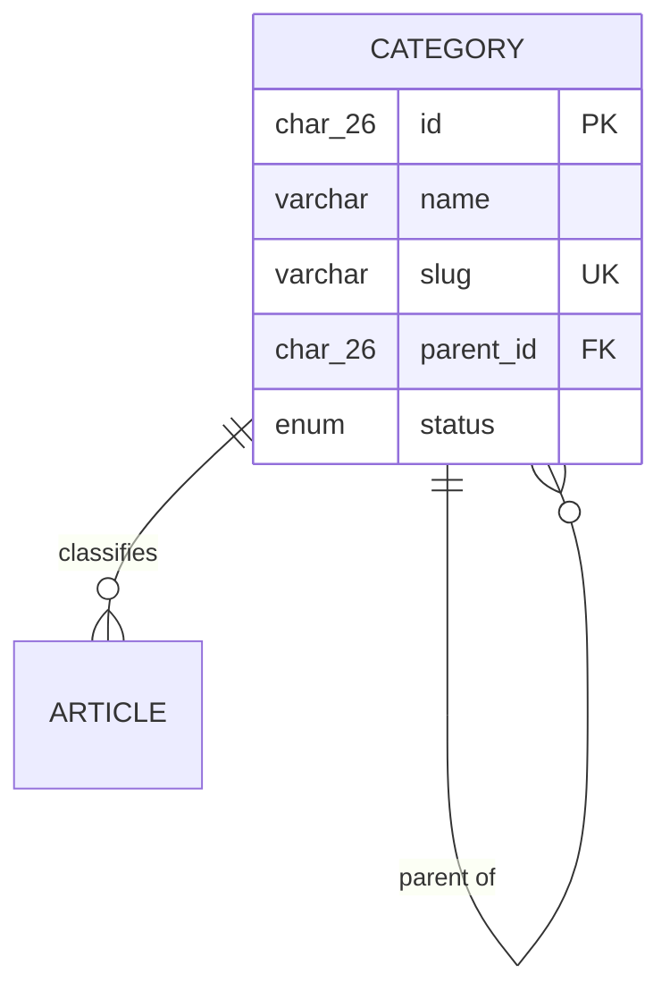

---

## Module: articles

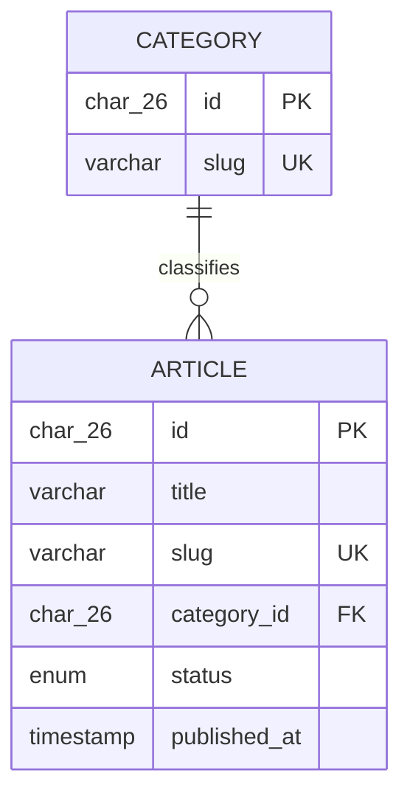

---

## Module: pages

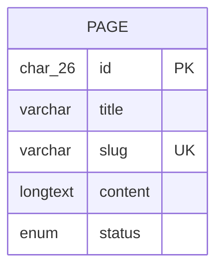

---

## Module: media

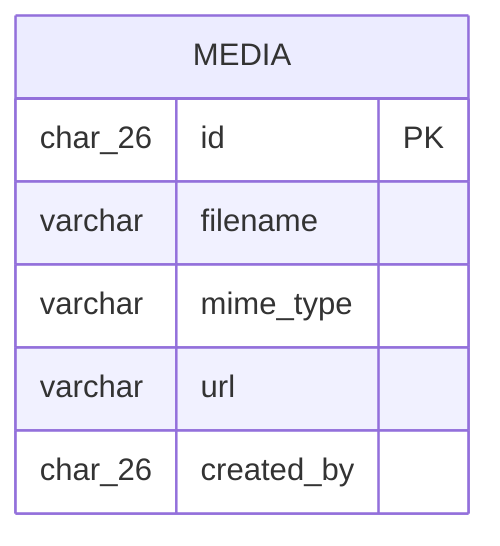

---

## Module: events

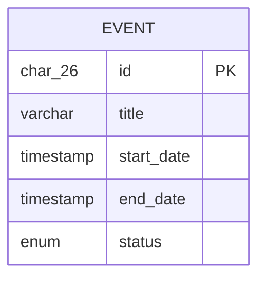

---

## Module: contacts

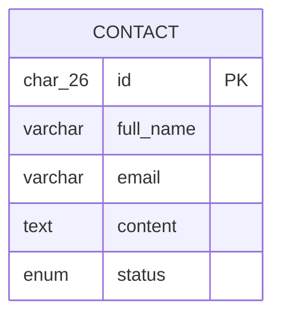

---

## Module: admissions

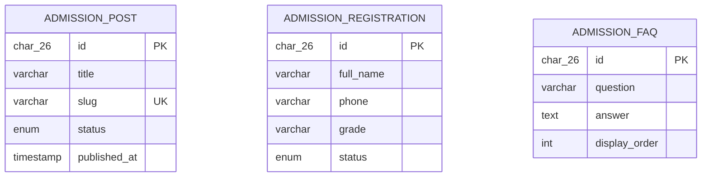

> Ghi chu: 3 entity nay khong co quan he FK truc tiep voi nhau. Post/Faq la noi dung cong khai, Registration la submission tu phu huynh.

---

## Module: navigation

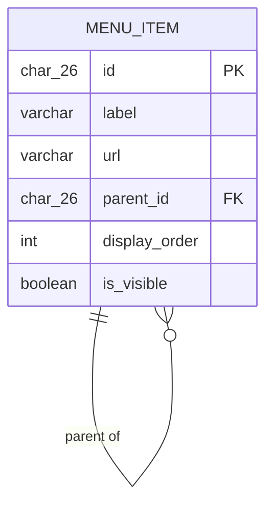

---

## Module: menus (food menu — thuc don an uong)

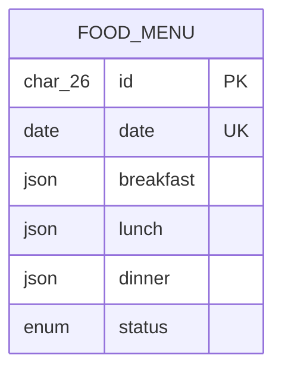

> Luu y: `food_menus` (thuc don bua an theo ngay) khac voi `menu_items` o module navigation (menu thanh dieu huong website).

---

## Module: settings

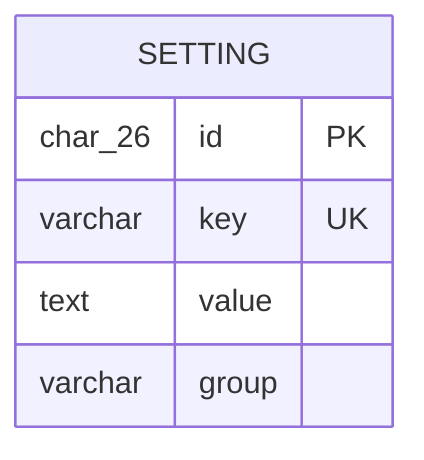

---

## Module: logs

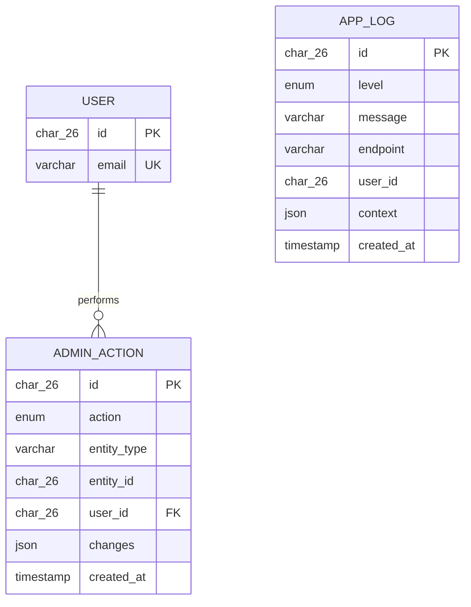

> Ghi chu: `app_logs.user_id` la tham chieu logic (nullable, khong FK cung) — log van giu duoc khi user bi xoa.

---

## Module: analytics

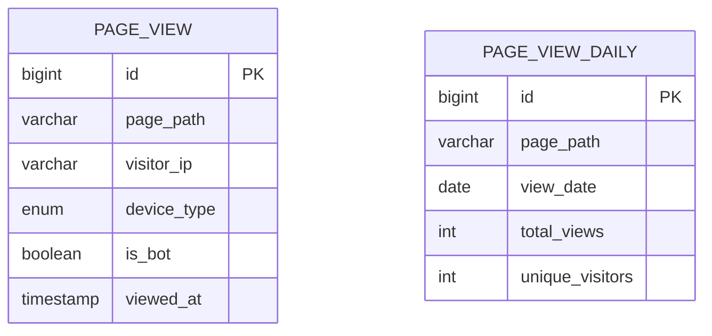

> Aggregation: `page_view_daily` la rollup tu `page_views` theo (page_path, view_date) — unique constraint `uq_page_view_daily`. Khong FK truc tiep.
